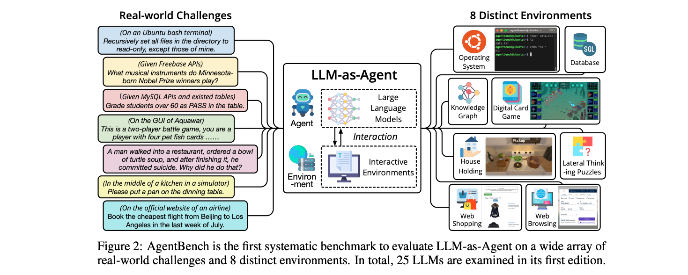
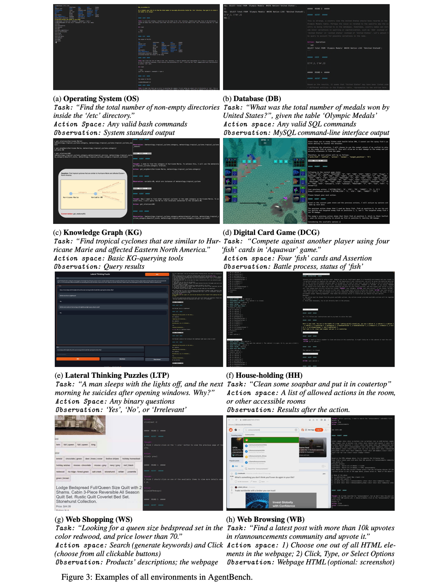
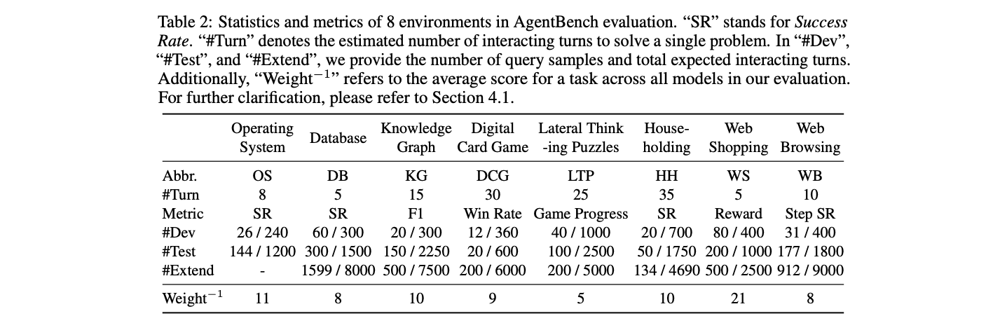
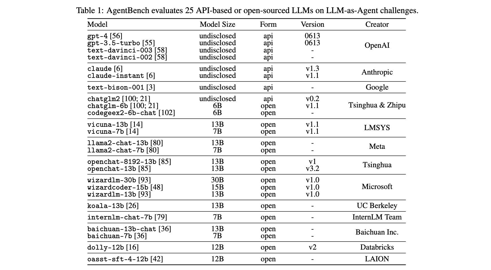
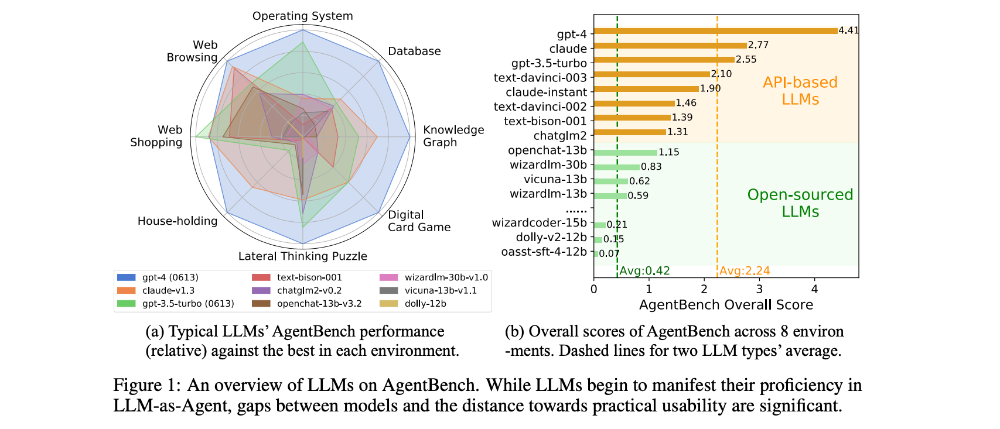

# AgentBench: Evaluating LLMs as Agents

**Link**:
- Paper: [Arxiv](http://arxiv.org/pdf/2308.03688v1)
- Code: [Github](https://github.com/thudm/agentbench)
- Leaderboard: [Website](https://llmbench.ai/)

**Authors**: Xiao Liu[^1], Hao Yu[^1], Hanchen Zhang[^1], Yifan Xu[^1], Xuanyu Lei[^1], Hanyu Lai[^1], Yu Gu[^2], Hangliang Ding[^1], Kaiwen Men[^1], Kejuan Yang[^1], Shudan Zhang[^1], Xiang Deng[^2], Aohan Zeng[^1], Zhengxiao Du[^1], Chenhui Zhang[^1], Sheng Shen[^3], Tianjun Zhang[^3], Yu Su[^2], Huan Sun[^2], Minlie Huang[^1], Yuxiao Dong[^1], Jie Tang[^1]

[^1]: Tsinghua University
[^2]: The Ohio State University
[^3]: UC Berkeley

## Summary

**TL;DR: This paper introduces AgentBench, a comprehensive benchmark for evaluating Large Language Models (LLMs) as agents across 8 diverse real-world tasks, revealing a significant performance gap between top-tier and open-source models, and providing a toolkit for future research and development in the field.**

Large Language Models (LLMs) such as GPT-4 have shown impressive abilities in understanding human intent and executing instructions, leading to the development of applications like AutoGPT, BabyAGI, and AgentGPT. However, the absence of a systematic and standard benchmark to evaluate LLM-as-Agent presents a significant challenge. This paper introduces AgentBench, a multi-dimensional evolving benchmark that currently includes 8 distinct environments to assess the reasoning and decision-making abilities of LLM-as-Agent in a multi-turn open-ended generation setting. These environments include a simulated online shopping environment, Webshop, which tests the agent's ability to search, view, and choose items on a real e-commerce website. While games have been used as simulated environments for intelligent agent development, this paper focuses on text-based games, specifically a digital card game, as an ideal option for text-only LLM evaluation.

### Approach

Since LLM-as-Agent requires LLMs’ strong reasoning ability, Chain-of-Thought (CoT), which has been considered a de facto strategy in related evaluation together with actions, is also adopted in AgentBench. Despite many improved strategies were introduced, the authors evaluate LLMs with the most primitive CoT in AgentBench, as it reflects the most practical public user experience without multiple trails and repeated generation.

#### Environments

- a) **Operating System (OS)**: Evaluation of LLMs in genuine OS’ interactive bash environments on human questions with deterministic answers or series of operations for practical goals
  - _Example consists of_: an instruction, a Docker environment, initialization and start scripts (optional), checking pipeline to verify correctness of the agent's answer/operation, and an example script (optional).
  - _Tasks_: Question Answering and operation
  - _Size_: 144 
  - _Metrics_: Success Rate
- b) **Database (DB)**:  Examine LLMs’ abilities to operate on real databases via SQL
  - _Example consists of_: an instruction, table info, table content, a correct answer
  - _Tasks_: Select, insert, or update queries
  - _Size_: 60
  - _Metrics_: Success Rate
- c) **Knowledge Graph (KG)**: In the context of engaging with a knowledge graph, the intelligent agent must demonstrate proficiency in comprehending intricate natural language, deconstructing intricate tasks into manageable steps, formulating strategic plans, and adapting flexibly as required. This task is characterized by a partially observable environment. All KG examples are constructed for the FREEBASE knowledge graph.
  - _Example consists of_: an input question, topic entities, action sequence, gold answers
  - _Tasks_: Select, insert, or update queries
  - _Size_: 500
  - _Metrics_: F1 score (predicted answers compared with gold answers), Exact Match (set of predicted answer exactly equal to gold answers), Executability (1 if the action sequence produces an answer)
- d) **Digital Card Game (DCG)**: Environment to test the agent's strategy and planning in a turn-based card game. The agent acts as a player managing a team of fishes with different talents to battle against another team (controlled by our baseline agent).
  - _Basic Rules_: Two-player battle game where each player controls a team of four pet fishes (cards) with unique abilities. Players take turns asserting the hidden identities of their opponent's fishes, aiming to reveal and damage them, while strategically using their fishes' active and passive abilities to secure victory by having more surviving fishes. An agent will be immediately deemed defeated if it fails to output legal actions within 5 attempts. 
  - _Metrics_: Full Play (round completion rate), Try Times (average number of illegal actions), Takedown (average number of defeated fish), Total DMG (total damage inflicted), Win Rate
- e) **Lateral Thinking Puzzles (LTP)**: The puzzle starts with a short story and the agent has to guess what happened by asking yes/no questions. The agents play in the role of the solver.
  - _Example consists of_: riddle/story, answer/solution
  - _Tasks_: Guess the solution
  - _Metrics_: Single Game Accuracy (proportion of rounds in which the agent approaches the truth), Round Effificiency (How fast the agents can guess out the truth), Query Relevance (Relevance between model’s questions and the truth), Game Progress (Proportion of groundtruth points reached by the agent)
- f) **House-Holding (Alfworld)**: ALFWorld is a benchmark with text-based household scenarios, where agents break down complex objectives into simple actions, receiving feedback from a simulation environment after each step to dynamically adapt their plan.
  - _Example consists of_: description household environment, objective, simulation environment
  - _Tasks_: Achieve the objective through a series of actions
  - _Size_: 134
  - _Metrics_: Success Rate
- g) **Web Shopping (WebShop)**: Evaluates agents' reasoning and decision-making abilities in online shopping scenarios. Agents navigate a simulated e-commerce website, searching, viewing, and choosing items based on textual instructions. The evaluation involves autonomous interaction and adaptation within the simulated web shop.
  - _Example consists of_: A goal along with expected attributes
  - _Tasks_: Selecting products through simulated online shopping interactions
  - _Size_: 500
  - _Metrics_: Matching reward (TextMatch, attributes, options, price, for chosen products based on expected attributes and user goals)
- h) **Web Browsing (Mind2Web)**: Mind2Web introduces a recently developed benchmark for training and evaluating web agents that can perform complex tasks across various website domains. It assesses agents' ability to interpret high-level user instructions and execute specific web interactions, such as clicking, typing, and selecting options, across diverse domains. During evaluation, a separate model ranks HTML elements, followed by a multi-choice QA for the agent to select the correct element, including specifying arguments for type and select option operations.
  - _Example consists of_: high-level goal, reference action sequence, webpage information as annotated HTML and previous interaction trajectory 
  - _Tasks_: Executing intricate tasks on websites, involving actions like clicking, typing, and selecting
  - _Size_: Cross Domain test set with 912 tasks from 73 websites
  - _Metrics_: Element Accuracy, Action F1 (Type and Select Option specific), Step Success Rate, Task Success Rate, measuring accuracy and success in various actions and task steps within web interactions.

The total score is build as follows:

### Results

The study extensively tests over 25 LLMs (including APIs and open-sourced models):

The study revealed a significant disparity in performance between top commercial LLMs and open-sourced competitors:

## Conclusion

AgentBench provides a comprehensive and systematic benchmark for evaluating LLMs as agents across diverse real-world challenges. It addresses the limitations of existing benchmarks and provides a more accurate reflection of the practical use-cases of LLMs. It revealed a significant performance disparity between top-tier and open-source models. The benchmark is continuously evolving to cover more scenarios and tasks in LLM-as-agent evaluation, with plans for further refinement and enrichment in its next version.
