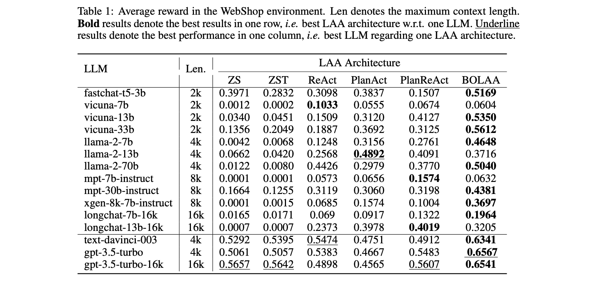

<!--- Created using: ... --->
<!--- Based on: 100.0% of the Paper --->
<!--- Reviewed: False --->
# BOLAA: Benchmarking and Orchestrating LLM-augmented Autonomous Agents

**Relevance: ...**

**Link**:
- Paper: [Arxiv](http://arxiv.org/pdf/2308.05960v1)

**Authors**: Zhiwei Liu[^1], Weiran Yao[^1], Jianguo Zhang[^1], Le Xue[^1], Shelby Heinecke[^1], Rithesh Murthy[^1], Yihao Feng[^1], Zeyuan Chen[^1], Juan Carlos Niebles[^1], Devansh Arpit[^1], Ran Xu[^1], Phil Mui[^2], Huan Wang[^1], Caiming Xiong[^1], Silvio Savarese[^1]

[^1]: Salesforce Research
[^2]: CTO Office, Salesforce

## Summary

**TL;DR: The paper explores LLM-augmented Autonomous Agents (LAAs), introducing a novel strategy (BOLAA) for managing multiple LAAs, and demonstrates that the BOLAA architecture outperforms others in complex tasks, with the best performance observed with Llama-2-70b, suggesting the potential of fine-tuning multiple smaller-sized specialised LAAs and the importance of pairing the LLM with the optimal LAA architecture.**

The paper systematically investigates LLM-augmented Autonomous Agents (LAAs), comparing various agent architectures and LLM backbones. It acknowledges the rise of applications like HuggingGPT, AutoGPT, BabyAGI, and frameworks like Langchain, and the potential of aligning the optimal architecture of agents with tasks and the corresponding LLM backbone. The paper explores the improvements that can be achieved by combining multiple specialized agents and how to manage multiple agents. 

### Approach

The paper discusses 5 different architectures for _solo agents_ and the new architecture introduced in the paper BOLAA as a multi-agent architecture.

#### Single Agent Architectures

- **Zeroshot LAA (ZS-LAA)**: This minimum LAA architecture directly extends LLM to generate actions using zeroshot prompts, allowing easy generalization to new environments without examples. It appends observations to memory and generates feasible actions. Compared to other architectures, ZS-LAA lacks the CoT reasoning ability and fewshot examples.

- **ZeroshotThink LAA (ZST-LAA)**: An extension of ZS-LAA, ZST-LAA includes a self-think flow for Chain-of-Thought reasoning in action generation, useful for reasoning tasks. It collects observations, stores thoughts in memory, and employs zero-shot think prompts. Compared to ZS-LAA, ZST-LAA introduces CoT reasoning but lacks fewshot examples.

- **ReAct LAA**: Building upon ZST-LAA, ReAct LAA uses fewshot examples in the prompt layer to enhance LLM's action generation ability and environment interaction. However, the limited context length poses a drawback as it restricts available token spaces after using fewshot examples. It introduces in-context learning but has token space limitations.

- **PlanAct LAA**: This architecture focuses on planning ability by generating a task plan before interacting with the environment. It employs a planning prompt in a fewshot manner to enable LAA to generate plans based on previous successful ones. It differs from ZS-LAA in planning and prompt aspects, emphasizing pre-interaction planning.

- **PlanReAct LAA**: An extension of PlanAct LAA, PlanReAct LAA adds self-think flow for CoT ability, enhancing reasoning during planning. It combines planning with self-think, allowing the agent to plan before observation and think in-between action generations. Compared to PlanAct LAA, PlanReAct LAA introduces CoT reasoning into planning.

#### BOLAA

The authors propose a new strategy, BOLAA, for managing multiple LAAs, where each agent specializes in a particular action and a controller oversees communication. The controller selects the most relevant LLAM and constructs the message for the selected LAA and establishes communication. After receiving the response from the labor LAA, the controller parses it into an executable action and then interacts with the environment. The work LAAs can also be designed as think/plan agents.

### Results

The experiments were done using the WebShop and HotPotQA benchmarks.

**WebShop** is a recently proposed online shopping website environment with 1.18M real-world products and human instructions. Each instruction is associated with one ground-truth product, and contains attribute requirements. In the WebShop environment, an agent operates either `SEARCH[QUERY]` or `CLICK[ELEMENT]` actions to interact the environment, for evaluating the interactive decision making ability of LAAs.

The BOLAA architecture consistently outperforms other LAA architectures in the WebShop environment, demonstrating the importance of designing specialist agents to collaborate on complex tasks. The paper also highlights the relationship between recall performance and reward performance, noting that high recall performance does not necessarily lead to high reward performance. 

**HotPotQA** with Wikipedia API tests LLAs' multi-step planning, comprehension, and information retrieval skills through complex multi-hop question-answering tasks, aiding the advancement of augmented language agents by assessing knowledge reasoning abilities using actions like SEARCH, LOOKUP, and FINISH. The authors argue since the available search, lookup and finish operations are all related to knowledge reasoning in this environment and hard to separate, they therefore leave the BOLAA arch for future work and only compare the performance on other agent arch.

In the HotPotQA environment, the ReAct agent architecture achieves the best performances, indicating that fewshot prompts are necessary to enable action generation and reasoning ability for LAAs. The paper also notes that the planning flow of LAA hinders performance in knowledge reasoning tasks, as these tasks require contextualized information for reasoning, which the planning flow, executed ahead of interactions, tends to hallucinate. The results show that model size is more important than context length for knowledge reasoning tasks, with larger models performing better.

### Conclusion

The paper underscores the necessity for additional research on coordinating multiple agents and its implications. It suggests that for more complex tasks, coordinating multiple agents could enhance efficiency. The authors advocate for the efficiency of orchestrating smaller LAAs, like BOLAA, when computing resources are limited, highlighting the potential of fine-tuning specialized LAAs rather than one large generalized LAA. Effective pairing of LLM with specific LAA architectures is essential, as seen with Llama-2-13b excelling under PlanAct LAA and Llama-2-70b performing optimally with BOLAA.
