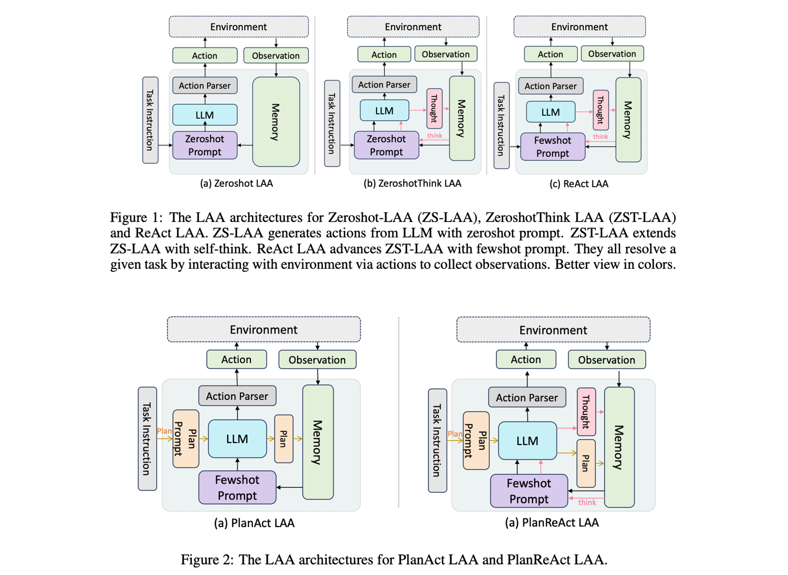
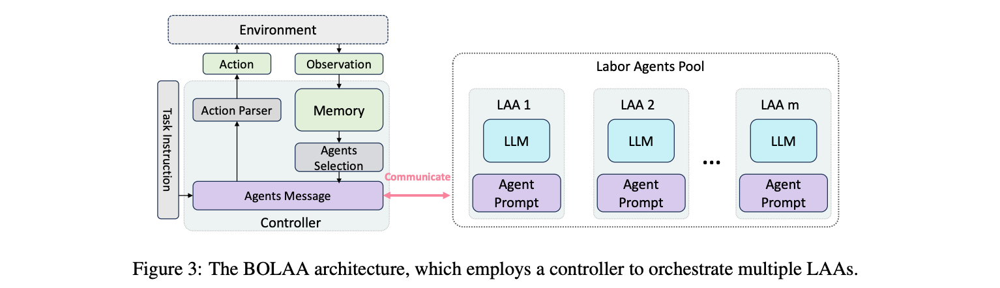

<!--- Created using: ... --->
<!--- Based on: 100.0% of the Paper --->
<!--- Reviewed: False --->
# BOLAA: Benchmarking and Orchestrating LLM-augmented Autonomous Agents

**Relevance: ...**

**Link**:
- Paper: [Arxiv](http://arxiv.org/pdf/2308.05960v1)

**Authors**: Zhiwei Liu[^1], Weiran Yao[^1], Jianguo Zhang[^1], Le Xue[^1], Shelby Heinecke[^1], Rithesh Murthy[^1], Yihao Feng[^1], Zeyuan Chen[^1], Juan Carlos Niebles[^1], Devansh Arpit[^1], Ran Xu[^1], Phil Mui[^2], Huan Wang[^1], Caiming Xiong[^1], Silvio Savarese[^1]

[^1]: Salesforce Research
[^2]: CTO Office, Salesforce

## Summary

**TL;DR: The paper explores LLM-augmented Autonomous Agents (LAAs), introducing a novel strategy (BOLAA) for managing multiple LAAs, and demonstrates that the BOLAA architecture outperforms others in complex tasks, with the best performance observed with Llama-2-70b, suggesting the potential of fine-tuning multiple smaller-sized specialised LAAs and the importance of pairing the LLM with the optimal LAA architecture.**

The paper systematically investigates LLM-augmented Autonomous Agents (LAAs), comparing various agent architectures and LLM backbones. It acknowledges the rise of applications like HuggingGPT, AutoGPT, BabyAGI, and frameworks like Langchain, and the potential of aligning the optimal architecture of agents with tasks and the corresponding LLM backbone. The paper explores the improvements that can be achieved by combining multiple specialized agents and how to manage multiple agents. 

### Approach

The paper discusses 5 different architectures for _solo agents_ and the new architecture introduced in the paper BOLAA as a multi-agent architecture.

#### Single Agent Architectures

- **Zeroshot LAA (ZS-LAA)**: This minimum LAA architecture directly extends LLM to generate actions using zeroshot prompts, allowing easy generalization to new environments without examples. It appends observations to memory and generates feasible actions. Compared to other architectures, ZS-LAA lacks the CoT reasoning ability and fewshot examples.

- **ZeroshotThink LAA (ZST-LAA)**: An extension of ZS-LAA, ZST-LAA includes a self-think flow for Chain-of-Thought reasoning in action generation, useful for reasoning tasks. It collects observations, stores thoughts in memory, and employs zero-shot think prompts. Compared to ZS-LAA, ZST-LAA introduces CoT reasoning but lacks fewshot examples.

- **ReAct LAA**: Building upon ZST-LAA, ReAct LAA uses fewshot examples in the prompt layer to enhance LLM's action generation ability and environment interaction. However, the limited context length poses a drawback as it restricts available token spaces after using fewshot examples. It introduces in-context learning but has token space limitations.

- **PlanAct LAA**: This architecture focuses on planning ability by generating a task plan before interacting with the environment. It employs a planning prompt in a fewshot manner to enable LAA to generate plans based on previous successful ones. It differs from ZS-LAA in planning and prompt aspects, emphasizing pre-interaction planning.

- **PlanReAct LAA**: An extension of PlanAct LAA, PlanReAct LAA adds self-think flow for CoT ability, enhancing reasoning during planning. It combines planning with self-think, allowing the agent to plan before observation and think in-between action generations. Compared to PlanAct LAA, PlanReAct LAA introduces CoT reasoning into planning.

#### BOLAA

The authors propose a new strategy, BOLAA, for managing multiple LAAs, where each agent specializes in a particular action and a controller oversees communication. The controller selects the most relevant LLAM and constructs the message for the selected LAA and establishes communication. After receiving the response from the labor LAA, the controller parses it into an executable action and then interacts with the environment. The work LAAs can also be designed as think/plan agents.

### Results

The paper underscores the importance of selecting optimal LLMs from both efficacy and efficiency perspectives to advance the exploration of LAAs. It notes that the increasing complexity of tasks may necessitate the orchestration of multiple agents, especially in open-domain environments. The BOLAA architecture consistently outperforms other LAA architectures in the WebShop environment, demonstrating the importance of designing specialist agents to collaborate on complex tasks. It also provides a detailed description of the working flow of ZS-LAA, ZST-LAA, and ReAct LAA, which directly extends the LLM to be an action executor, and introduces the concept of 'self-think' steps and fewshot examples in the prompt layer. The paper also evaluates LAAs in the HotPotQA environment, a multi-hop question answering task that requires reasoning over multiple Wikipedia passages. The evaluation metrics include the reward score in each environment and the Recall performance for the WebShop environment. The paper also compares different LLMs with various choices of model size and context length, including fastchat-3b, vicuna-3b/13b/33b, Llama-2-7b/13b/70b6, MPT-7b/30b, xgen-8k-7b, longchat-16k-7b/13b and OpenAI API LLMs, such as text-davinci-003, gpt-3.5-turbo and gpt-3.5-turbo-16k. The paper also highlights the relationship between recall performance and reward performance, noting that high recall performance does not necessarily lead to high reward performance. It also observes that the BOLAA model consistently performs better across all LLMs and complexity levels, indicating that separating the search agent from the click agent improves the accuracy of the search action, leading to a higher recall value. In the HotPotQA environment, the ReAct agent architecture achieves the best performances, indicating that fewshot prompts are necessary to enable action generation and reasoning ability for LAAs. The paper also notes that the planning flow of LAA hinders performance in knowledge reasoning tasks, as these tasks require contextualized information for reasoning, which the planning flow, executed ahead of interactions, tends to hallucinate. It also highlights that model size is more important than context length for knowledge reasoning tasks, with larger models performing better. The superior reasoning ability of OpenAI gpt-3.5 models is again verified, and the best performance of all open-source LLMs is observed with Llama-2-70b, suggesting potential for future fine-tuning on Llama-2 models. The paper also observes a degradation in performance with increasing task complexity. However, the Llama-2-70b model demonstrates comparable reasoning ability with the OpenAI text-davinci-003 model, especially in hard questions, indicating its potential in handling complex tasks.

### Conclusion

The paper concludes by emphasizing the need for further research into orchestrating multiple agents and the impacts of such orchestration. It suggests that as task complexity increases, coordinating multiple agents to complete a single task may be more efficient. The paper's contributions include the development of six different LAA agent architectures and extensive experiments on decision-making web navigation and knowledge reasoning task environments. It also highlights the importance of incorporating feedback mechanisms, such as environment rewards, to enhance agent behaviors. The superiority of BOLAA indicates that orchestrating multiple smaller-sized LAAs is a better choice if the computing resources are limited. This further exemplifies the potential for fine-tuning multiple smaller-sized specialised LAAs rather than fine-tuning one large generalized LAA. Pairing the LLM with the optimal LAA architecture is crucial. For example, Llama-2-13b performs best under PlanAct LAA arch while Llama-2-70b performs best under the BOLAA arch. Also, Longchat-13b-16K performs best when using PlanAct and PlanReAct, which may indicate the extraordinary planning ability of longchat-13b-16k models. Increasing the context length alone may not necessarily improve the LAA performances. For example, when comparing longchat-13b-16k with llama-2-13b models, the latter yields better performances though with less context length. The paper also highlights that a powerful LLM can generalize under the zeroshot LAA arch, and that the best performance of OpenAI API-based models are actually under ZS and ZST arch. This indicates the great potential of developing a generic LAA with powerful LLM, and that using only a ZS LAA can already achieve comparable or even better performances than LAA arch with additional Plan or Self-think flow. However, for other less powerful LLMs, fewshot prompts are necessary for LAAs. The paper also identifies the challenge of designing BOLAA architecture for environments with compounding actions and suggests future exploration of harnessing LLMs in the controller for fully autonomous selection and communication with labor agents.
