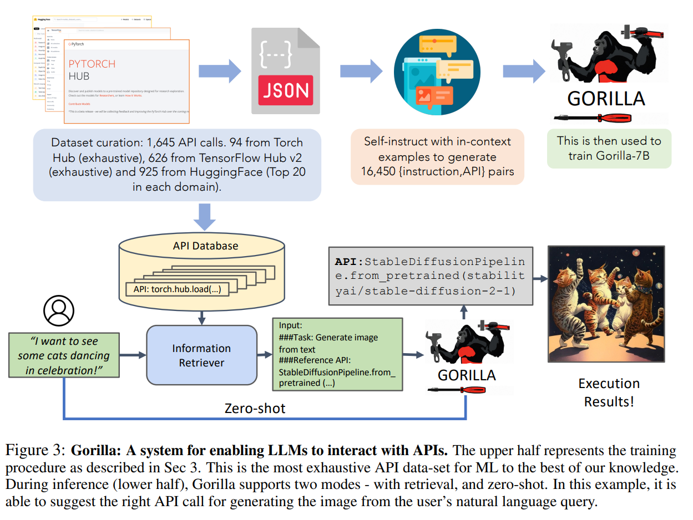
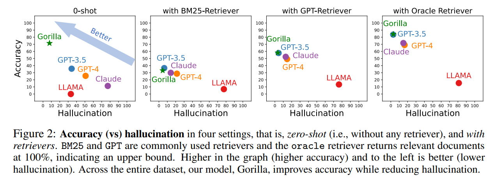

# Gorilla: Large Language Model Connected with Massive APIs

**Link:** [Paper](https://arxiv.org/abs/2305.15334)

**Authors:** Shishir G. Patil[^1], Tianjun Zhang[^1], Xin Wang[^2], Joseph E. Gonzalez[^1]

[^1]: UC Berkeley
[^2]: Microsoft Research

## Summary

The paper introduces *Gorilla*, a fine-tuned model based on LLaMA that outperforms GPT-4 at writing API calls. The authors propose a comprehensive dataset, *APIBench*, for evaluation, including a wide range of HuggingFace, TorchHub, and TensorHub APIs.

The paper discusses how current large language models (LLMs) struggle to generate accurate API calls, often making incorrect input arguments or hallucinating incorrect usages. *Gorilla* addresses these issues and, when combined with a document retriever, demonstrates a strong ability to adapt to document changes at test time. This allows for flexible user updates or version changes, and greatly reduces the hallucination problem that is common with direct LLM prompting. The system supports two modes of inference - with retrieval and zero-shot. They also discuss the challenges of API calls, including the inherent constraints and the need for the LLM to understand and categorize calls according to different constraint parameters. Since *Gorilla* learns the APIs through fine-tuning and not through in-context learning. Therefore, the number of tools at the expense of the LLM is not limited by the length of the prompt, rather it can be millions of tools.

### Approach

The authors collected a model cards and the corresponding API calls from TorchHub (94 API calls), TensorHub (696 API calls) and HuggingFace. Since Huggingface hosts a large number of models, and many of the models have no specification, the authors choose at max the 20 most downloaded models per task category (925 API calls). These 1,645 API calls stored as json object with the following fields: `{domain, framework, functionality, api_name, api_call, api_arguments, environment_requirements, example_code, performance, description}´. 
Using the self-instruct paradigm, the authors used GPT-4 to generate synthetic instruction data from three hand-crafted in-context examples, randomly selected from 6 examples generated per model hub, and the previously extracted API information. For each of the 1645 API data points, they generated 10 instructions, for a total dataset of 16450 instruction-API pairs.

The *Gorilla*, is retrieve-aware fine-tuned LLaMA-7B model, specifically for API calls. They trained two versions. For the first version they used the previously created instruction-API pairs in a user-agent chat-style conversation, where each data-point is a conversation with one round each for the user and the agent. In a second *retriever-aware* training an additional `Use this API documentation for reference: <retrieved_API_doc_JSON>` was appended to the user prompt.

### Results

### Conclusion