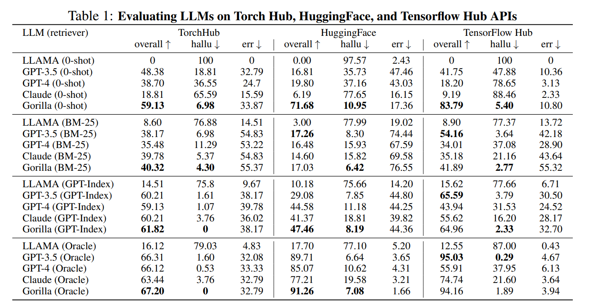

# Gorilla: Large Language Model Connected with Massive APIs

**Link:** [Paper](https://arxiv.org/abs/2305.15334)

**Authors:** Shishir G. Patil[^1], Tianjun Zhang[^1], Xin Wang[^2], Joseph E. Gonzalez[^1]

[^1]: UC Berkeley
[^2]: Microsoft Research

## Summary

The paper introduces *Gorilla*, a fine-tuned model based on LLaMA that outperforms GPT-4 at writing API calls. The authors propose a comprehensive dataset, *APIBench*, for evaluation, including a wide range of HuggingFace, TorchHub, and TensorHub APIs.

The paper discusses how current large language models (LLMs) struggle to generate accurate API calls, often making incorrect input arguments or hallucinating incorrect usages. *Gorilla* addresses these issues and, when combined with a document retriever, demonstrates a strong ability to adapt to document changes at test time. This allows for flexible user updates or version changes, and greatly reduces the hallucination problem that is common with direct LLM prompting. The system supports two modes of inference - with retrieval and zero-shot. They also discuss the challenges of API calls, including the inherent constraints and the need for the LLM to understand and categorize calls according to different constraint parameters. Since *Gorilla* learns the APIs through fine-tuning and not through in-context learning. Therefore, the number of tools at the expense of the LLM is not limited by the length of the prompt, rather it can be millions of tools.

### Approach

**Dataset**: The authors collected a model cards and the corresponding API calls from TorchHub (94 API calls), TensorHub (696 API calls) and HuggingFace. Since Huggingface hosts a large number of models, and many of the models have no specification, the authors choose at max the 20 most downloaded models per task category (925 API calls). These 1,645 API calls stored as json object with the following fields: `{domain, framework, functionality, api_name, api_call, api_arguments, environment_requirements, example_code, performance, description}`. 
Using the self-instruct paradigm, the authors used GPT-4 to generate synthetic instruction data from three hand-crafted in-context examples, randomly selected from 6 examples generated per model hub, and the previously extracted API information. For each of the 1645 API data points, they generated 10 instructions, for a total dataset of 16450 instruction-API pairs.

**Model**: The *Gorilla*, is retrieve-aware fine-tuned LLaMA-7B model, specifically for API calls. They trained two versions. For the first version they used the previously created instruction-API pairs in a user-agent chat-style conversation, where each data-point is a conversation with one round each for the user and the agent. In a second *retriever-aware* training an additional `Use this API documentation for reference: <retrieved_API_doc_JSON>` was appended to the user prompt.

**Evaluation**: The API contains multiple functionally equivalent calls. To verify whether a predicted API call is equivalent to the reference the authors use a *AST tree-matching* strategy. They check whether the AST tree of the predicted calls is a subtree of the AST Tree constructed from the whole dataset. If the tree of the prediction is not a sub-tree it is treated as an hallucination. This form of hallucination is distinct from invoking an API incorrectly which they instead define as an error.

### Results

The authors carried out an array of experiments on the collected dataset, benchmarking their model with other models and exploring how different retrieval methods may impact the performance of the model in making API calls. The compared models are `gpt-4`, `gpt-3.5-urbo`, `claude-v1` and LLaMA-7B (*Gorilla*'s base model). All models are tested in a zero-shot and three different retrieval scenarios, in which the documentation of an API is added to the prompt. The used retrievers are: BM25 retriever, GPT-Index retriever (`text-davinci-003` as a retrieval model) and an Oracle retriever (adding the correct API).

They conducted successful tests where they changed the API documentation during the test time in the retriever scenario and the model was able to take the changes into account. In addition, the authors ran some tests where additional information (e-g- model accuracies on specific datasets) was added to the dataset and the model was prompted with constraints related to these information. Accuracy dropped for all models, but *Gorilla* remained competitive with the best performing model GPT-3.5 when using retrievals (BM25, GPTIndex) and has the highest accuracy in the zero-shot case. This highlights *Gorilla*'s ability to navigate APIs while considering the tradeoffs between different constraints.

### Conclusion

LLMs are rapidly gaining popularity in various fields. In the study, the authors presented techniques designed to improve the LLM's ability to accurately identify the appropriate API for a given task. Because APIs function asuniversal language that allows disparate systems to communicate effectively, their proper use can enhance the ability of LLMs to interact with tools in the wider world. The finetuned model’s performance surpasses prompting the state-of-the-art LLM (GPT-4) in three massive datasets we collected. Gorilla generates reliable API calls to ML models without hallucination, demonstrates an impressive capability to adapt to test-time API usage changes, and can satisfy constraints while picking APIs.