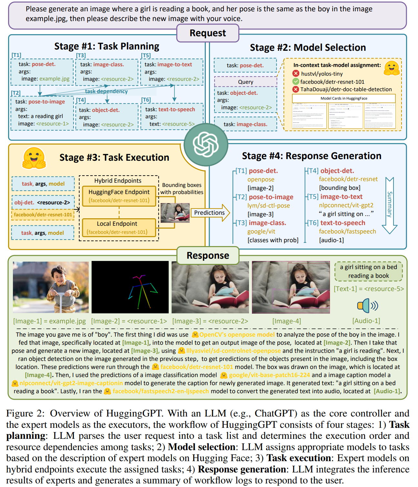
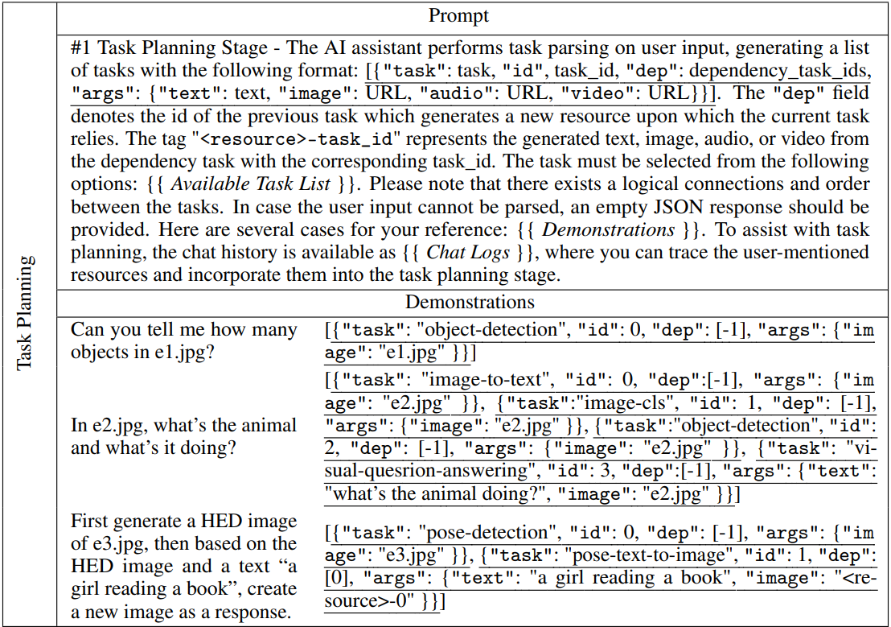
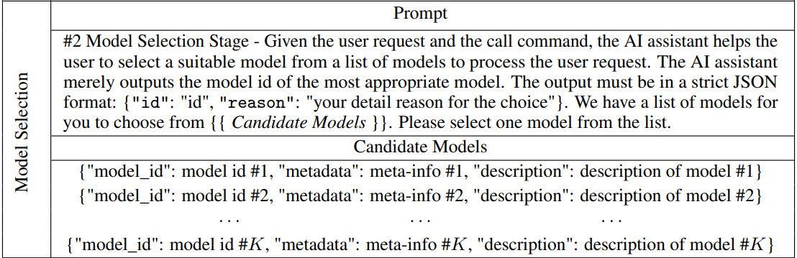
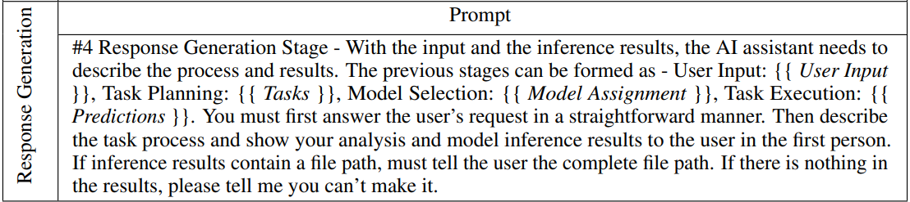
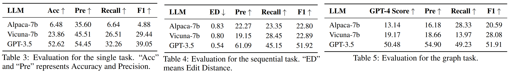

# H*uggingGPT*: Solving AI Tasks with ChatGPT and its Friends in Hugging Face

**Link:** [Paper](https://arxiv.org/abs/2303.17580)

**Authors:** Yongliang Shen[^1][^2], Kaitao Song[^2]∗, Xu Tan[^2], Dongsheng Li[^2], Weiming Lu[^1], Yueting Zhuang[^1]

[^1]: Zhejiang University
[^2]: Microsoft Research Asia

## Summary

The authors present an autonomous system that collaborates with various machine learning models to automate tasks. *HuggingGPT* is a pipeline consisting of four stages: task planning, model selection, task execution, and response generation. The system can support a broad range of tasks in language, vision, audio, and more, by utilizing models from the Hugging Face hub. It uses GPT-4 as an evaluator to assess its planning capabilities. The paper also details the use of local inference endpoints alongside cloud-based ones for better efficiency and stability. The document presents several case studies showing the system's proficiency in handling various tasks, including complex and multi-modal ones.

### Approach

The authors propose a four step approach in which the LLM (ChatGPT) is the brain while expert models are selected and used to execute subtasks.

1. **Task Planning**: Using ChatGPT to analyze the requests of users to understand their intention, and disassemble them into possible solvable tasks via prompts.

The task planning aims to use LLM to analyze user request and then decompose it into a collection of structured tasks with dependencies and execution order. *HuggingGPT* employs a prompt design, which consists of
*specification-based instruction* and *demonstration-based parsing*. For *specificaton-based instruction* the LLM is instructed to output task in a specific json-format: `"task"`, `"id"`, `"dep"`, and `"args"`. To better understand the intention and criteria for task planning, HuggingGPT incorporates multiple demonstrations consisting of a user request and its corresponding output (expected sequences of parsed tasks) in the prompt. The authors call this *demonstration-based parsing*.

2. **Model Selection**: To solve the planned tasks, ChatGPT selects expert models that are hosted on Hugging Face based on model descriptions.

Due to the constraints regarding maximum context length, it is impossible for a prompt to include all relevant model information. Therefore, models are filtered based on their task type and ranked based on the number of their downloads. Afterwards, the top-K models are presented to an LLMs as the candidate models to do *in-context task-model assignment*.

3. **Task Execution**: Invoke and execute each selected model, and return the results to ChatGPT. The task execution order is done based on the planning. Results of executed tasks are used in the subsequent steps as additional input. Multiple tasks that
have satisfied the prerequisite dependencies are started simultaneously to improve inference efficiency.

4. **Response Generation**: Finally, ChatGPT is utilized to integrate the predictions from all models and generate responses for users.

All the information from the previous three stages (task planning, model selection, and task execution) are used to create a concise summary in this stage, including the list of planned tasks, the selected models for the tasks, and the inference results of the models. These inference results are presented in a structured format, such as bounding boxes with detection probabilities in the object detection model, answer distributions in the question-answering model, etc. HuggingGPT allows LLM to receive these structured inference results as input and generate responses in the form of friendly human language.

### Results

Experiments were conducted using `gpt-3.5-turbo`, `Vicunia-7B` and `Alpaca-7B`.

Task planning is the first but also the most important step in the whole workflow, since it directly determines the result of the subsequent pipeline. Therefore, the authors deem that task planning provides a reliable metric for evaluating the ability of LLMs. To better conduct evaluations on task planning, they group tasks into three distinct categories:
- **Single Task** refers to a request that involves only one task. We consider the planning to be correct when and only when the task name (i.e., "task") and the predicted label are identically equal. F1 and accuracy are chosen as evaluation metrics for single-task scenarios.
- **Sequential Task** represents that the intent of the user request can be decomposed as a sequence of multiple sub-tasks. Here,  F1 and normalized Edit Distance as the metrics are used.
- **Graph Task** indicates that user requests can be decomposed into directed acyclic graphs. Considering the possibility of multiple planning topologies within graph tasks, only using F1-score is not enough to reflect the LLM capability in planning. To address this, following employed GPT-4 as a critic to evaluate whether the planning is correct. The accuracy is obtained by evaluating the judgment of GPT-4, referred to as the GPT-4 Score.

To conduct the evaluation, some annotators were invited to submit some requests. They used GPT-4 to generate task planning as the pseudo labels, which cover single, sequential, and graph tasks. Furthermore, some expert annotators labeled task planning for some complex requests (46 examples) as a high-quality human annotated dataset. 

### Conclusion

In conclusion, HuggingGPT represents a promising approach to harness the power of LLMs in managing and integrating various AI models to solve complex tasks with various modalities.