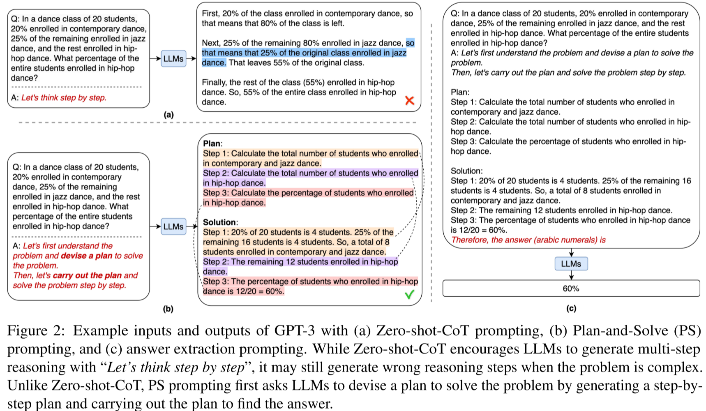
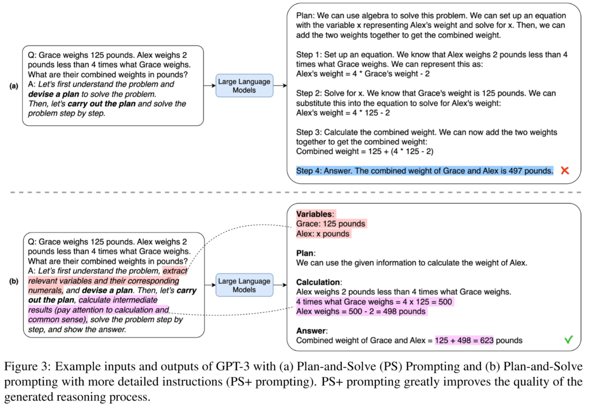
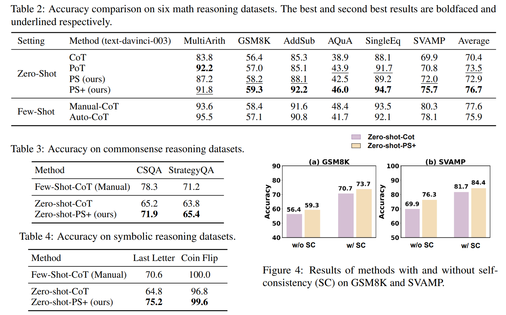

# Plan-and-Solve Prompting: Improving Zero-Shot Chain-of-Thought Reasoning by Large Language Models 

**Link:** [Paper](https://arxiv.org/abs/2305.04091)

**Authors:** Lei Wang[^1], Wanyu Xu[^2], Yihuai Lan, Zhiqiang Hu[^3], Yunshi Lan[^4], Roy Ka-Wei Lee[^3], Ee-Peng Lim[^1]

[^1]: Singapore Management University
[^2]: Southwest Jiaotong University
[^3]: Singapore University of Technology and Design
[^4]: East China Normal University

## Summary

The paper presents a new approach, termed Plan-and-Solve (*PS*) Prompting, to improve the reasoning capabilities of large language models (LLMs). The *PS* Prompting method addresses the limitations of Zero-shot Chain-of-Thought (Zero-shot-CoT) by dividing the task into smaller subtasks, planning and solving them sequentially. To tackle calculation errors and improve the quality of reasoning steps, the authors extend *PS* prompting with more detailed instructions, forming *PS*+ prompting. The experimental results indicate that *PS* and *PS+* prompting methods significantly outperform Zero-shot-CoT, match or surpass Zero-shot-Program-of-Thought Prompting, and have comparable performance with 8-shot CoT prompting on math reasoning problems.

### Approach



Despite the success of Zero-shot-CoT, it still suffers from three pitfalls: calculation errors, missing-step errors, and semantic misunderstanding errors. To address the missing-step errors, we propose Planand-Solve (*PS*) Prompting. It consists of two components: first, devising a plan to divide the entire task into smaller subtasks, and then carrying out the subtasks according to the plan:
```
Q: [X].
A: Let’s first understand the problem and devise a plan to solve the problem. Then, let’s carry out the plan and solve the problem step-by-step.
```

To address the calculation errors and improve the quality of generated reasoning steps, the authors extend *PS* prompting with more detailed instructions and derive *PS*+ prompting. The more detailed instructions are tailored towards the task.



### Results

The *PS* and *PS+* prompting methods were evaluated on the ten benchmark datasets from three categories of reasoning problems: arithmetic, commonsense, and symbolic reasoning. The methods are compared to
1. Zero-shot baselines: zero-shot-CoT ("Let's think step by sep" - no examples) and zero-shot-PoT (utilize an LLM to generate python code to solve the task).
2. Few-shot with manual demonstrations: eight hand-crafted examples as demonstrations
3. Few-shot with automatic demonstrations: examples selected by clustering with diversity and generates reasoning chains using zero-shot-CoT to construct demonstrations




### Conclusion

Plan-and-Solve prompting strategies (*PS* and *PS+* prompting) are introduced. These are new zero-shot prompting methods that guide LLMs to develop a plan that divides the whole task into smaller subtasks and then execute the subtasks according to the plan. Evaluation on ten datasets across three types of reasoning problems shows that PS+ prompting outperforms previous zero-shot baselines and performs on a par with few-shot CoT prompting on several arithmetic reasoning datasets.
