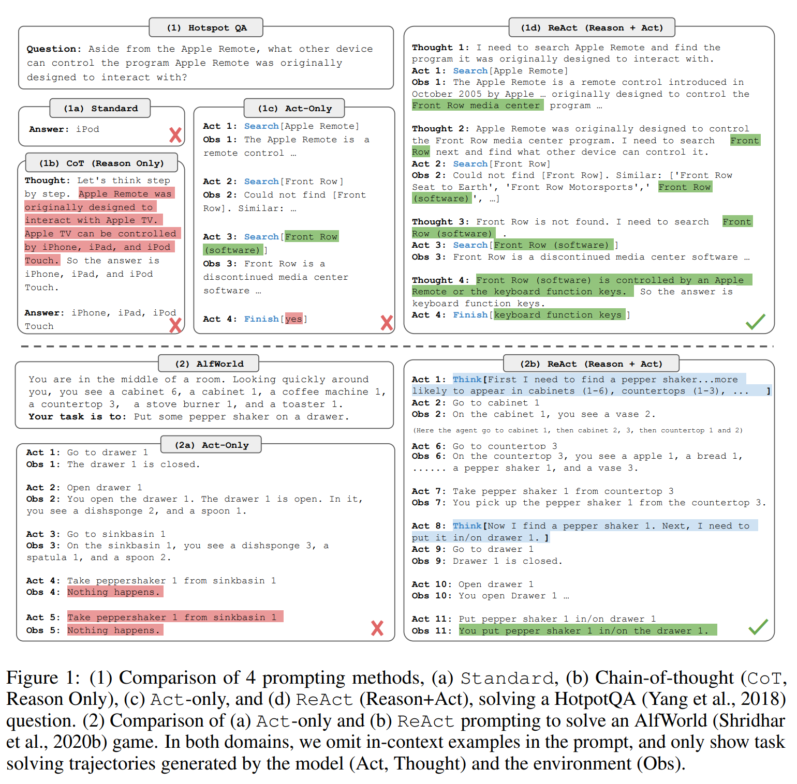
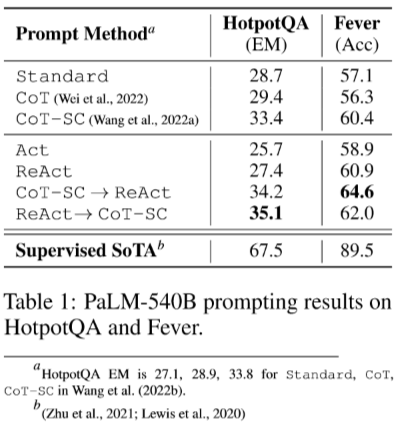
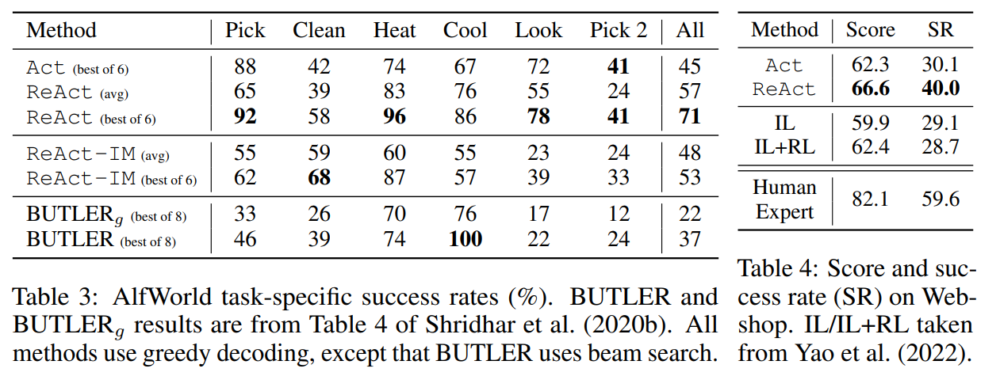

# ReAct: Synergizing Reasoning and Acting in Language Models 

**Link:** [Paper](https://openreview.net/forum?id=WE_vluYUL-X)

**Authors:** Shunyu Yao[^1], Jeffrey Zhao[^2], Dian Yu[^2], Nan Du[^2], Izhak Shafran[^2], Karthik Narasimhan[^1], Yuan Cao[^2]

[^1]: Department of Computer Science, Princeton University
[^2]: Google Research, Brain Team

## Summary

The paper explores the use of large language models (LLMs) for generating both reasoning traces and task-specific actions in an interleaved manner. This approach is applied to various language and decision-making tasks. The model, named REACT, helps in inducing, tracking, and updating action plans as well as handling exceptions. It also interfaces with and gathers additional information from external sources like knowledge bases or environments. The authors claim that REACT outperforms state-of-the-art baselines and improves human interpretability and trustworthiness.

### Approach

The approach is to mimic the ability known from human intelligence "to seamlessly combine task-oriented actions with verbal reasoning or inner speech, which has been theorized to play an important role in human cognition for enabling self-regulation or strategization and maintaining a working memory". The approach is similar to chain-of-thought prompting ("Let's think step-by-step"), but spells out its thoughts instead "that the model uses its own internal representations to generate thoughts and is not grounded in the external world, which limits its ability to reason reactively or update its knowledge".

The **Re**easoning**Act**ting has several features:

1. **Intuitive and easy to design**: Designing ReAct prompts is straightforward as human annotators just type down their thoughts in language on top of their actions taken.
2. **General and flexible**: Due to the flexible thought space and thought-action occurrence format, ReAct works for diverse tasks with distinct action spaces and reasoning needs.
3. **Performant and robust**: ReAct shows strong generalization to new task instances while learning solely from one to six in-context examples, consistently outperforming baselines with only reasoning or acting across different domains.
4. **Human aligned and controllable**: ReAct promises an interpretable sequential decision making and reasoning process where humans can easily inspect reasoning and factual correctness.

In practice the prompts includes in-context examples to instruct the LLM to follow the schema (see examples in figure above). The prompt allows explains/defines the action space. The schema for ReAct is: `Thought → Action → Observation`
- `Thought`: Formulated thought for the current step
- `Action`: Action taken for the current step
- `Observation`: Result of the action

The action space can be freely defined for the task and can be used to augement the model with external tools. The model executes as many repetitions of the `Thought → Action → Observation`-sequence until a final answer/solution to the task is reached. To let the model exit its loop an action `finish[answer]` is added to the action space.

### Results

To evaluate the ReAct-Pattern the authors benchmark the approach in two "knowledge-intensive reasoning task" benachmarks and two "decision making task" scenarios. The LLM used for the experiments is a frozen PaLM-540B model.

#### Knowledge-intensive Reasoning Task

The benchmarks are "HotpotQA" and "FEVER". The action space for the LLM is come from a simple Wikipedia API (`search[entitiy]` and `lookup[string]`). The prompting patterns compared are:

- `Standard`: Simply ask the LLM for an answer
- `CoT`: Instruct the model to think step-by-step (only reasoning and internal knowledge)
- `CoT-SC`: Sampling multiple `CoT` solutions and use a majority vote to provide the final answer (only reasoning and internal knowledge)
- `Act`: `Action → Observation` iterations (only acting)
- `ReAct`: `Thought → Action → Observation` iterations
- `CoT-SC → ReAct`: Fallback to `ReAct` when no clear majority can be found in `CoT-SC`
- `ReAct → CoT-SC`: When after `n_max` `ReAct`-iteration no answer was found fallback to `CoT-SC`

#### Decision Making Tasks

The scenarios to benchmark the decision making are "" and ""

**ALFWorld** is a synthetic text-based game designed to align with the embodied ALFRED benchmark (Shridhar et al., 2020a). It includes 6 types of tasks in which an agent needs to achieve a high-level goal (e.g. examine paper under desklamp) by navigating and interacting with a simulated household via text actions (e.g. go to coffeetable 1, take paper 2, use desklamp 1). The baseline for the benchmark is BUTLER an imitation agent trained with recorded action trajectories.

**WebShop** is a online shopping website environment with 1.18M real-world products and 12k human instructions. Unlike ALFWorld, Webshop contains a high variety of structured and unstructured texts (e.g. product titles, descriptions, and options crawled from Amazon), and requires an agent to purchase a product based on a user instruction (e.g. “I am looking for a nightstand with drawers. It should have a nickel finish, and priced lower than $140”) through web interactions (e.g. search “nightstand drawers”, choose buttons such as “color: modern-nickel-white” or “back to search”). The baseline for the benchmark are a imitation learning and an imiation + reinforcement learning agent trained on with recorded action trajectories.

### Conclusion

ReAct - a simple yet powerful method for synergising reasoning and action in large language models. It shows superior performance with interpretable decision traces. The authors have also carried out some experiments to fine-tune the models with samples using the ReAct pattern, with promising results.