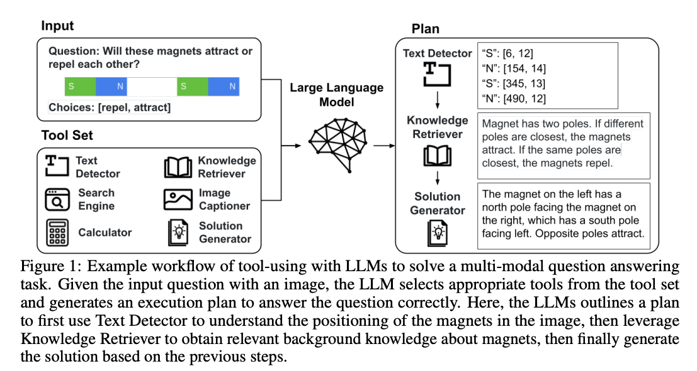

<!--- Created using: gpt-4 --->
<!--- Reviewed: False --->
# Tool Documentation Enables Zero-Shot Tool-Usage with Large Language Models

**Link**: [Paper](http://arxiv.org/pdf/2308.00675v1)

**Authors**: Cheng-Yu Hsieh[^1], Si-An Chen[^2], Chun-Liang Li[^3], Yasuhisa Fujii[^4], Alexander Ratner[^1], Chen-Yu Lee[^3], Ranjay Krishna[^1], Tomas Pfister[^3]

[^1]: University of Washington
[^2]: National Taiwan University
[^3]: Google Cloud AI Research
[^4]: Google Research

## Summary

**TL;DR: This study demonstrates that using tool documentation, rather than demonstrations, can effectively teach large language models (LLMs) new tools, simplifying the process, reducing bias, and improving scalability, with the performance of LLMs even improving with the comprehensiveness of the documentation, up to a certain length.**

The study explores the potential of using tool documentation, akin to a craftsman's manual, as a method for teaching large language models (LLMs) new tools. The authors argue that demonstrations, while effective, can be difficult to obtain, may lead to biased usage if not carefully chosen, and lack a systematic approach for selection. This issue becomes more complex as the number of tools and tasks increase. The paper likens an LLM to a craftsman, breaking down complex tasks into simpler ones and choosing the best tools for each sub-task. The performance of LLMs can be further boosted with external tool usages to be more accurate, efficient or versatile for wider applications.

### Approach

The researchers propose the use of tool documentation, which provides neutral and detailed descriptions of individual tool usage, as an alternative to demonstrations. They support their proposition with empirical evidence from six tasks across both vision and language modalities. Due to length constraints, a TF-IDF search is employed to retrieve the most relevant documentations. They follow the general framework of tool-using with LLMs: given a natural language instruction, an LLM planner generates a program to be sequentially executed where each step of the program may rely on using tools selected from a tool set. After the program is generated, it is then executed by an environment which finally returns the execution results.

### Results

The experiments were done with 6 tasks across multiple modalities:
- Multi-modal question answering on _ScienceQA_
- Tabular math reasoning on _TabMWP_
- Multi-modal reasoning on _NLVRv2_
- Unseen API usage on a newly collected dataset
- Image editing with natural language.
- Video tracking

The study found that zero-shot prompts with only tool documentation were sufficient to elicit proper tool usage, matching or exceeding the performance of few-shot prompts on existing benchmarks. On a newly collected realistic tool usage dataset with hundreds of available tool APIs, tool documentation was significantly more beneficial than demonstrations.

The authors derive three empirical findings from the experiments:
- **Documentations sidestep the need for demonstrations**: The results on ScienceQA, TabMWP, and NLVRv2 show that when provided with tool documentation, the model is able to maintain stable performance as we reduce the number of demos used. By eliminating the need for demos, the effort required to carefully curate these demos is reduced, and the risk of biasing the model with the examples is eliminated.
- **Documentations enable efficient scaling on tool-using**: A tool documentation retriever (here based on TF-IDF) allows scaling to a large number of tools. This scaling based on demonstrations is costly and therefore often not feasible. It also shows little to no benefit over 0-shot prompting with documentation.
- **Documentations allow to equip LLMs with unseen tools to solve novel tasks**: Solely on documentation the models can be taught to use new tools and combine them to solve novel tasks. The authors used GroundingDINO (open-set object
detector), Segment Anything (SAM; image segmentation tool) and XMem (video object segmentation tool) as new tools to let the LLM _re-invent_ the popular project _Grounded-SAM_ and the work on _Track Anything_ without piror knowledge. 

- **Documentations allow to equip LLMs with unseen tools to solve novel tasks**: Experiments show a trend where performance improves as the document length increases, up to a length of 600. Showing that the models possess the ability to comprehend and leverage documentation effectivelym highlighting the tremendous value of providing comprehensive documentation. After the document length exceeds 600 words the performance degradated. This decline is most likely due to the inherent challenges associated with comprehending lengthy documents in language models.

## Conclusion

This paper investigates the effectiveness of tool docs in enabling zero-shot tool usage with LLMs. It is shown that LLMs can achieve equal or better performance than their few-shot counterparts when provided with tool docs, and allow scaling to a significantly larger tool set on a newly collected tool. By simply plugging in new tools along with their docs, LLMs were able to tackle unseen tasks. Overall, the authors shed light on tool use with LLMs by focusing on their internal planning and reasoning capabilities with docs, rather than explicitly guiding their behavior with demos.
