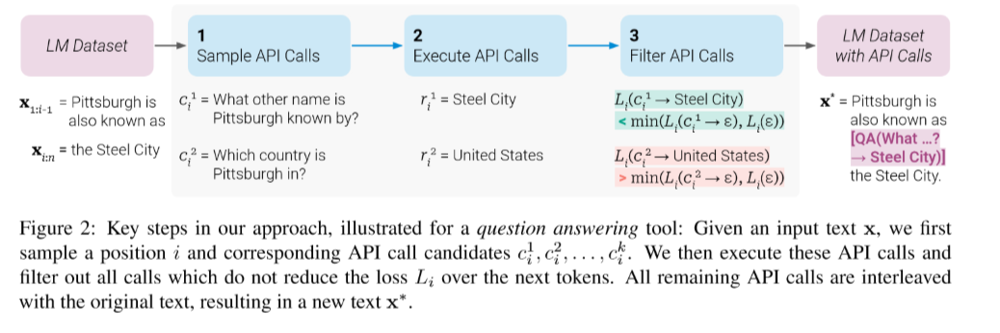
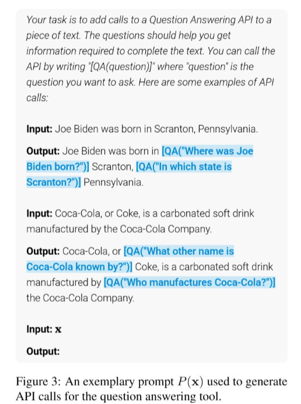
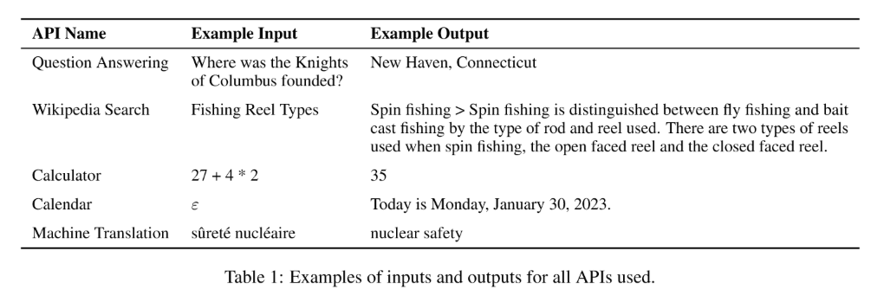
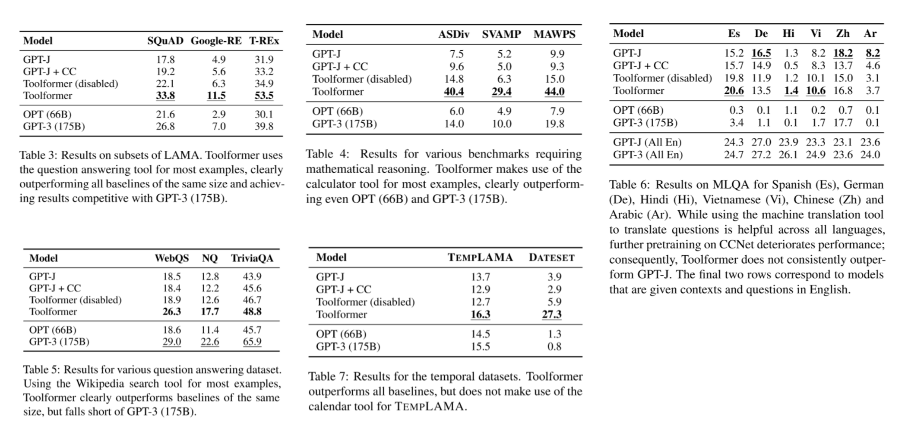

# Toolformer: Language Models Can Teach Themselves to Use Tools

**Link**: [Paper](https://arxiv.org/abs/2302.04761)

**Authors**: Timo Schick[^1], Jane Dwivedi-Yu[^1], Roberto Dessì[^2], Roberta Raileanu[^1], Maria Lomeli[^1], Luke Zettlemoyer[^1], Nicola Cancedda[^1], Thomas Scialom[^1]

[^1]: Meta AI
[^2]: Universitat Pompeu Fabra

**TL;DR: Self-supervised language model that is trained to use external APIs, thereby bridging the gap between large-scale language models' abilities to solve complex tasks and their struggles with basic functionalities like arithmetic or factual lookup.**

## Summary

The paper discusses the paradox of language models (LMs) that show the ability to solve new tasks from just a few examples or textual instructions, especially at scale, but struggle with basic functionality, such as arithmetic or factual lookup, where simpler and smaller models excel.

The authors introduce a model, *Toolformer* that is trained to decide which APIs to call, when to call them, what arguments to pass, and how to best incorporate the results into future token prediction. This is done in a self-supervised way, requiring nothing more than a handful of demonstrations for each API. They incorporate a range of tools, including a calculator.

### Approach

#### Dataset

For the supervised training of the *Toolformer* the used multi-step approach to create the training dataset. 

1. **Sample API Calls**
  Utilizing an LLM with in-context learning to create samples

2. **Execute API Calls**
  Use samples from step 1. and execute the calls.

3. **Filter API Calls**
  For the dataset they only want to accept  API calls that actually help the model to give the correct answer. To do so they compare the loss for the model with the API output provided vs. no output/only API inputs provided.

The examples passing step 3 are kept for supervised training.
  
#### Model Finetuning

The completion for the model looks like this `[<tool>(<inputs> → <tool-output>)]`. The tools avaiable to the *Toolformer* are: Question Answering, Calculator, Wikipedia Search, Machine Translation System, Calendar.

During infence once the `→`-token is reached the decoding process is stopped and the tool is executed with the inputs generated.
For the training examples the tool output is available and and the output is appended to the decoded sequence before continuig the decoding process.

They basemodel for the *Toolformer* is a 6.7B parameter GPT-J model.

### Results

The *Toolformer* is compared on several different tasks against its basemodel GPT-J, the GPT-J model finetuned their dataset without any API calls and the Toolformer with API calls disabled. In addition they included the results of OPT (66B) and GPT-3 (175B).

The downstream tasks evaluate are: LAMA (complete a short statement with a a missing fact), Math Datasets (mathematical reasoning), Question Answering, Multilingual Question Answering and Temporal Datasets (LAMA-like cloze queries about facts that change with time).

### Conclusion

We have introduced *Toolformer*, a language model that learns in a self-supervised way how to use different tools such as search engines, calculators, and translation systems via simple API calls. This is done by finetuning on a large number of sampled API calls that are filtered based on whether they reduce perplexity on future tokens. *Toolformer* considerably improves zero-shot performance of a 6.7B parameter GPT-J model, enabling it to even outperform a much larger GPT-3 model on a range of different downstream tasks.

## Rating

- **Relevance (1-5)**: Does the paper's topic align with your areas of interest or research?
- **Novelty (1-5)**: How novel is the approach or result presented in the paper?
- **Clarity (1-5)**: How well is the paper written? Is it easy to understand the concepts and methodologies?
- **Depth of Research (1-5)**: Is the paper thorough in its treatment of the subject matter, including background research and analysis?
- **Practicality (1-5)**: How practical or applicable are the findings or methodologies presented in the paper?