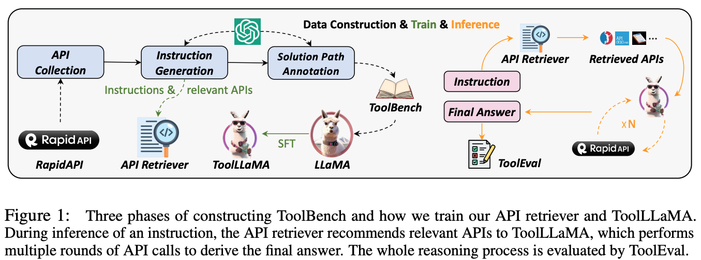
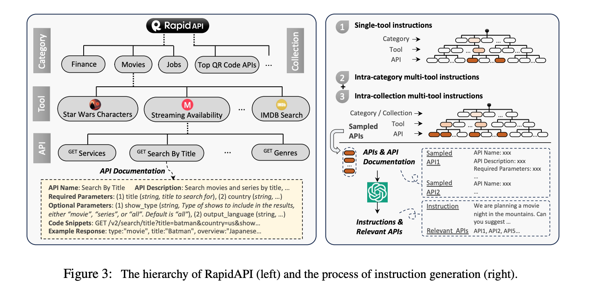
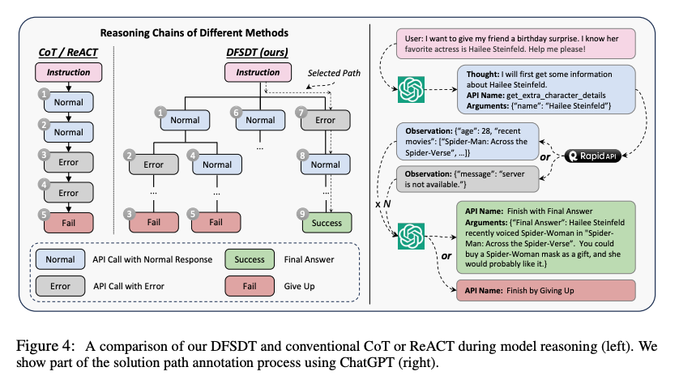
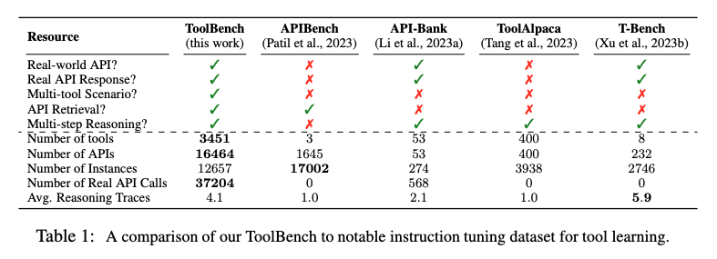
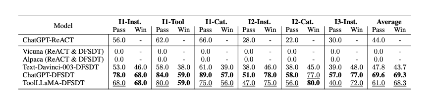
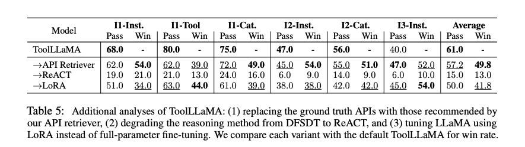

# ToolLLM: Facilitating Large Language Models to Master 16000+ Real-world APIs

**Links**:
- Paper: [Arxiv](http://arxiv.org/pdf/2307.16789v1)
- Code: [GitHub](https://github.com/openbmb/toolbench)

**Authors**: Yujia Qin[^1], Shihao Liang[^1][^2], Yining Ye[^1], Kunlun Zhu[^1][^2], Lan Yan[^1][^2], Yaxi Lu[^1], Yankai Lin[^3], Xin Cong[^1], Xiangru Tang[^4], Bill Qian[^4], Sihan Zhao[^1], Runchu Tian[^1], Ruobing Xie[^5], Jie Zhou[^2], Mark Gerstein[^4], Dahai Li[^2][^6], Zhiyuan Liu[^1], Maosong Sun[^1]

[^1]: Tsinghua University
[^2]: ModelBest Inc.
[^3]: Renmin University of China
[^4]: Yale University
[^5]: WeChat AI, Tencent Inc.
[^6]: Zhihu Inc.

## Summary

**TL;DR: The study introduces ToolLLM and ToolBench, a framework and dataset respectively, aimed at enhancing the tool-use capabilities of large language models (LLMs), with the developed ToolLLaMA (ToolLLM applied to LLaMA) demonstrating robust performance in executing complex instructions and generalizing to unseen APIs, thus contributing to the democratization of AI technologies.**

The study focuses on tool learning, a process that enables large language models (LLMs) to interact effectively with various tools (APIs) to accomplish complex tasks. Despite the versatility of open-source LLMs like LLaMA and Vicuna, they lack the sophistication required for higher-level tasks, such as understanding human instructions and interacting appropriately with tools. This is due to the focus of instruction tuning on basic language tasks rather than the tool-use domain. The researchers aim to address this gap and democratize AI technologies by empowering open-source LLMs to master diverse APIs.

### Approach

The researchers introduced **ToolLLM**, a general tool-use framework, and **ToolBench**, an instruction-tuning dataset for tool use.

The construction of **ToolBench** focuses on two crucial aspects: the diversity of API usage scenarios and the use of multiple tools. The dataset was built in three phases, API collection, instruction generation, and solution path annotation. In the API collection phase, the researcher crawled RapidAPI Hub and collected 16,464 real-world RESTful APIs from 3,451 different tools/systems. For the instruction generation, `gpt-3.5-turbo-16k` was used. The prompt consisted of a general description of the intended instruction generation task, documentation for a set of pre-selected APIs, and three randomly selected in-context examples, drawn from a pool of 12+36 examples (12 for a single-tool scenario and 36 for a multi-tool scenario). For the single-tool examples (referenced as `I1`), only APIs from the same tool were present in the prompt. For the multi-tool examples, the author used RapidAPI's hierarchy information and selected 2-5 tools from the same category (`I2`)/collection `I3`), and sampled a maximum of 3 APIs from each tool. The instruction generation does not include a complete solution path. This is generated in the subsequent step. The result of the instruction generation was an instruction and the relevant APIs as a subset of all sampled APIs.

Given an instruction and the sampled API `gpt-3.5-turbo-16k` was tasked to generated a solution path as a multi-round conversation. The authors propose a decision-tree approach (DFSDT) in which a valid path is searched for in a depth-first search. The DFSDT allows the model to assess different reasoning paths and choose to either proceed along a promising path or abandon an existing node. During node expansion, to diversify the child nodes and expand the search space, the model is prompted with the information of the previously generated nodes and explicitly encouraged to generate a distinct node.

To improve the inference of the model, the authors used the **ToolBench** dataset to trained an **API Retriever** that aims to retrieve relevant APIs for an instruction. They used Sentence-Bert to encode the instruction and the API documentation into two embeddings. Relevance is determined by the similarity of these two embeddings. During training, they considered the relevant API of each instruction as positive examples and sampled a few APIs as negative examples for contrastive learning.

To evaluate and compare different models the authors introduced [**ToolEval**](https://openbmb.github.io/ToolBench/), which incorporates two evaluation metrics: 
- Pass Rate: proportion of successfully completing an instruction within 200 actions
- Win Rate: ChatGPT (`gpt-3.5-turbo-16k`) was used as an evaluator to compare two solution paths for a given instruction. If both answers solve the instruction, the one with the smaller number of steps is chosen as the winner. The better final answer is used as a tie-breaker. If only one answer solves the statement, that answer wins; if both fail, the one with more successful API calls wins.

### Results

The researchers fine-tuned LLaMA on ToolBench to create **ToolLLaMA**. Their automatic evaluator, ToolEval, showed that ToolLLaMA could execute complex instructions and generalize to unseen APIs, exhibiting comparable performance to ChatGPT. Although extensive prompt engineering was conducted, both Vicuna and Alpaca failed to pass any instructions, underscoring the deficiency of current instruction tuning methods, which largely focus on enhancing language skills.

The API retriever exhibited remarkable retrieval precision, returning APIs closely aligned with the ground truth.

## Conclusion

The study presents a significant advancement in enhancing the tool-use capabilities of open-source LLMs. The researchers have made [the codes, trained models, and demo publicly available](https://github.com/OpenBMB/ToolBench), paving the way for further research and practical applications in this domain. In general, ToolLLaMA (LLaMA trained using ToolBencht in the ToolLLM framework) demonstrated competitive performance in all scenarios, achieving a pass rate slightly lower than ChatGPT+DFSDT. For the win rate, ToolLLaMA generally matched ChatGPT+DFSDT’s capability and even surpassed the latter in the I2-Cat. setting.
