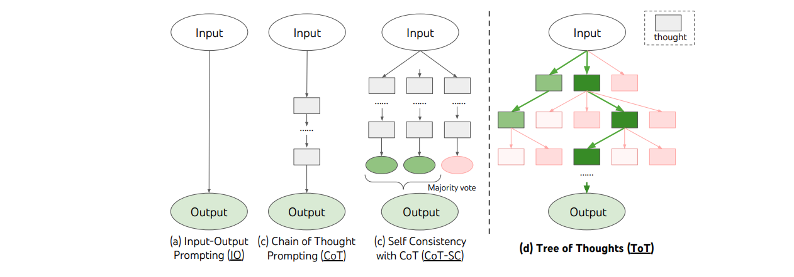
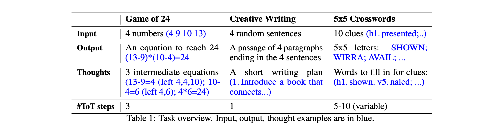
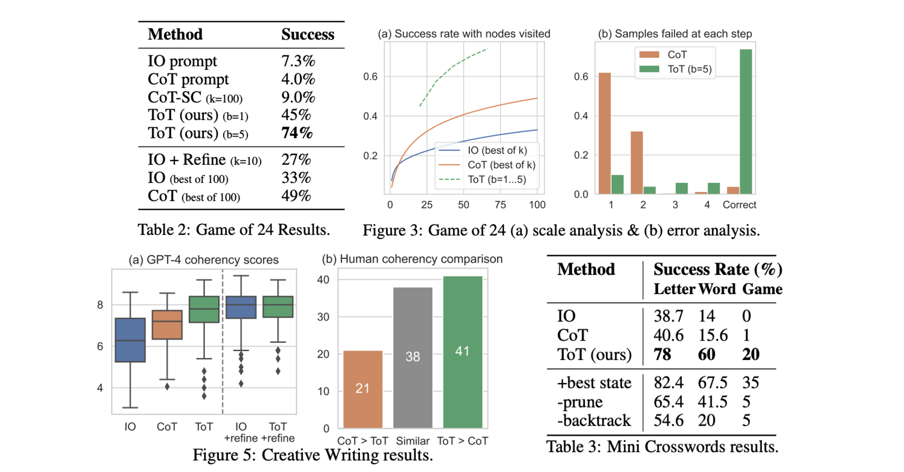

<!--- Created using: gpt-4 --->
<!--- Reviewed: False --->
# Tree of Thoughts: Deliberate Problem Solving with Large Language Models

**Link**: [Paper](http://arxiv.org/pdf/2305.10601v1)

**Authors**: Shunyu Yao[^1], Dian Yu[^2], Jeffrey Zhao[^2], Izhak Shafran[^2], Thomas L. Griffiths[^1], Yuan Cao[^2], Karthik Narasimhan[^1]

[^1]: Princeton University
[^2]: Google DeepMind

## Summary

**TL;DR: The 'Tree of Thoughts' (ToT) framework is a novel approach to problem-solving with Language Learning Models (LLMs), enabling more deliberate decision-making and strategic planning, and demonstrating superior performance on challenging tasks, while also improving the interpretability of model decisions and offering potential for future applications.**

Language models, such as GPT and PaLM, have been increasingly used for problem-solving across various tasks, including those requiring mathematical, symbolic, commonsense, and knowledge reasoning. However, their current inference methods, which are confined to token-level, left-to-right decision-making processes, can fall short in tasks that require exploration, strategic lookahead, or where initial decisions are crucial. Drawing inspiration from the literature on human cognition, 'dual process' models, and the planning processes explored by Newell, Shaw, and Simon in the 1950s, the authors propose a new framework for language model inference, 'Tree of Thoughts' (ToT). This framework generalizes the 'Chain of Thought' approach to prompting language models and allows for exploration over coherent units of text ('thoughts') that serve as intermediate steps towards problem-solving. ToT enables language models to perform deliberate decision-making by considering multiple reasoning paths, self-evaluating choices, and making global choices by looking ahead or backtracking when necessary.

### Approach

The 'Tree of Thoughts' (ToT) framework is illustrated through various approaches to problem-solving with Language Learning Models (LLMs). Each 'thought', represented as a rectangle box, is a coherent language sequence that serves as an intermediate step towards problem-solving. The ToT framework allows the model to generate, evaluate, and search through these 'thoughts'. A specific instantiation of ToT involves answering four questions:

1. How to decompose the intermediate process into thought steps - **Though decomposition**: A thought should be “small” enough so that LMs can generate promising and diverse samples, yet “big” enough so that LMs can evaluate its prospect toward problem solving.
2. How to generate potential thoughts from each state - **Though generator**: Two methods: _Sample_ thoughts form a CoT prompt; _Propose_ thoughts sequentially using a propose prompt.
3. How to determine which states to keep exploring and in which order.  - **State evaluator**: Two methods: _Value_ each state independently; _Vote_ across states
4. What search algorithm to use - **Search algorithm**: Two methods: _Breadth-first search_; _Depth-first search_

The authors use an LLM for the state evaluation, whereas previously the evaluation was mostly done by a heuristic or learned.

### Results

The authors propose three new problems that challenge existing LM inference methods even with the state-of-the-art language model, GPT-4: Game of 24, Creative Writing, and Crosswords. These tasks require deductive, mathematical, commonsense, lexical reasoning abilities, and a way to incorporate systematic planning or search. 

The ToT framework obtains superior results on all three tasks by being general and flexible enough to support different levels of thoughts, different ways to generate and evaluate thoughts, and different search algorithms that adapt to the nature of different problems. The authors also analyze how such choices affect model performances via systematic ablations. In the Game of 24, a mathematical reasoning challenge, the ToT framework was tested on a subset of relatively hard games. The success of the model was measured by its ability to generate a valid equation that equals 24 using the input numbers each exactly once. The ToT setup for the Game of 24 involved decomposing the thoughts into 3 steps, each an intermediate equation. A breadth-first search (BFS) was performed in ToT, keeping the best 5 candidates at each step. The model was prompted to evaluate each thought candidate as 'sure/maybe/impossible' with regard to reaching 24, promoting correct partial solutions and eliminating impossible ones. Additionally, the ToT framework was found to generate more coherent passages than IO and CoT, with an average GPT-4 score of 7.56 across 100 tasks, compared to 6.19 for IO and 6.93 for CoT. Human evaluators also preferred ToT over CoT in 41 out of 100 passage pairs. In the Mini Crosswords task, the ToT framework achieved a success rate of 78%, significantly outperforming other methods. 

## Conclusion

The 'Tree of Thoughts' (ToT) framework provides a novel approach to problem-solving with Language Learning Models (LLMs), allowing for more deliberate decision-making and strategic planning. The framework's flexibility and adaptability to different problems and reasoning abilities have been demonstrated through its superior performance on three challenging tasks. Future directions include further exploration of how to better train and use LMs within this framework, particularly focusing on the decomposition of the intermediate process into thought steps, the generation of potential thoughts from each state, the heuristic evaluation of states, and the choice of search algorithm. The ToT framework has several benefits including generality, modularity and adaptability.
