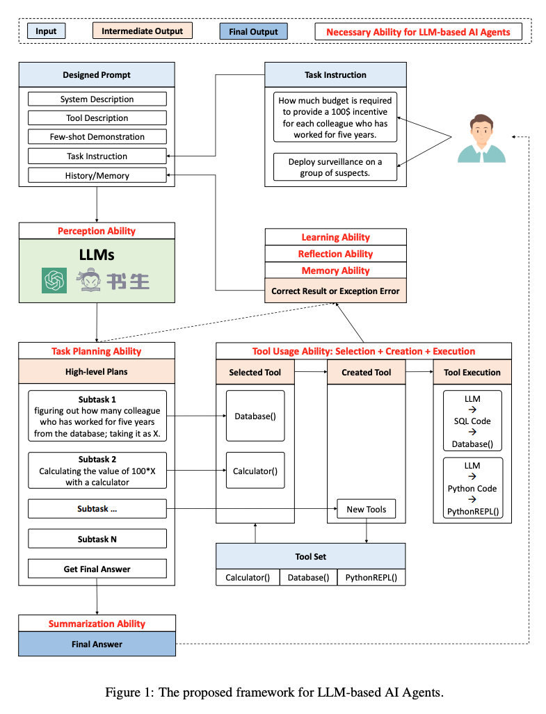

# TPTU: Task Planning and Tool Usage of Large Language Model-based AI Agents

**Link**: [Paper](http://arxiv.org/pdf/2308.03427v1)

**Authors**: Jingqing Ruan[^1], Yihong Chen, Bin Zhang[^1], Zhiwei Xu[^1], Tianpeng Bao[^1], Guoqing Du[^1], Shiwei Shi[^1], Hangyu Mao[^1], Xingyu Zeng[^1], Rui Zhao[^1]

[^1]: SenseTime Research

## Summary

**TL;DR: This study presents a structured framework for Large Language Models (LLMs) based AI agents, introducing a novel approach for flexible problem-solving, and demonstrating through evaluations that these agents, particularly ChatGPT, show significant potential in task planning, tool usage, and managing complex tasks, thus highlighting their promising prospects for future research and real-world applications.**

The paper presents a structured framework for Large Language Models (LLMs) based AI agents, focusing on their task planning and tool usage capabilities. It introduces two types of agents, one-step and sequential, to facilitate the inference process. The study is particularly interested in the AI Agent that employs the LLM techniques due to its high efficiency and flexibility in various tasks and domains. The LLMs evaluated include models developed by various organizations such as OpenAI, Anthropic, Shanghai AI Lab, IDEA, and Tsinghua University. The paper also discusses the limitations of traditional deep learning approaches and the advantages of LLMs in terms of comprehension of tool functionality, user intentions, and common sense reasoning abilities.

### Approach

The authors argue that an AI Agents needs 5 basic abilities:

1. **Perception**: Perceive the task instruction from human and system specifications.
2. **Task Planing**: Create a step-by-step plan for complex task composition
3. **Tool Usage**: Select from a variety of existing tools/resources and create new tools based on the task requirements
4. **Learning/Reflection/Memory**: Learn from feedback, including correct results and failures
5. **Summarization**: Summarize the interaction history and provide a final answer

In the eye of the authors task planning and tool usage (TPTU) represent the cornerstone of LLM’s abilities. Others like perception, learning/reflection/memory, and summarization are indeed critical, but they primarily serve to enhance and support these two core competencies.

They propose to differ between two types of **TPTU** agents: **O**ne-step **A**gents (**TPTU-OA**) and **S**equential **A**gents (**TPTU-SA**). While TPTU-OAs generate a plan upfront that is executed without adjustments, TPTU-SAs tackle the current sub-task at hand. Upon successful resolution of the ongoing sub-task, these agents generate start working on the succeeding sub-task.

### Results

The authors create TPTU-OAs and TPTU-SA based on their proposed LLM-based AI Agent framework with different LLMs and evaluate their performance on typical tasks.

The evaluation results showed a marked improvement when the tool-subtask pairs are generated in a unified format compared to a separate generation of tools and subtasks. 

In the evaluation of end-to-end ability of multiple tools, ChatGPT achieved a performance rate of 50% in the TPTU-OA evaluation, significantly outperforming the other models, with InternLM at 15%, while both Ziya and Chinese-Alpaca did not manage to complete any tasks successfully, resulting in a score of 0%. In the TPTU-SA evaluation, ChatGPT maintained its leading position, with a slightly improved performance rate of 55%. InternLM also exhibited better performance, achieving a score of 20%, whereas Ziya and Chinese-Alpaca-Plus again failed to register any successful task completion.

### Conclusion

The study introduces a structured framework designed for LLM-based AI Agents, emphasizing their abilities in task planning and tool usage. The framework, along with the design of two distinct types of agents for the inference process, allows for a comprehensive evaluation of the capabilities of current open-source LLMs, providing critical insights into their effectiveness. The research underscores the significant potential of LLMs in managing complex tasks and their promising prospects for future research and development. The study also highlights the importance of tailoring evaluation and training methodologies to the individual strengths and weaknesses of each model.
