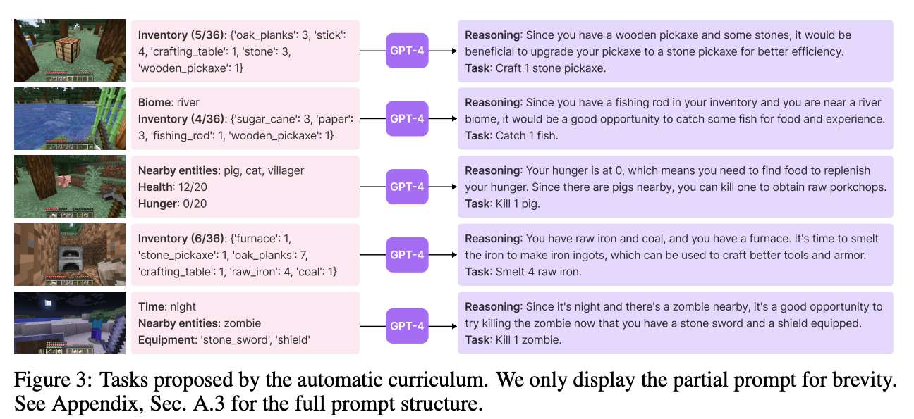
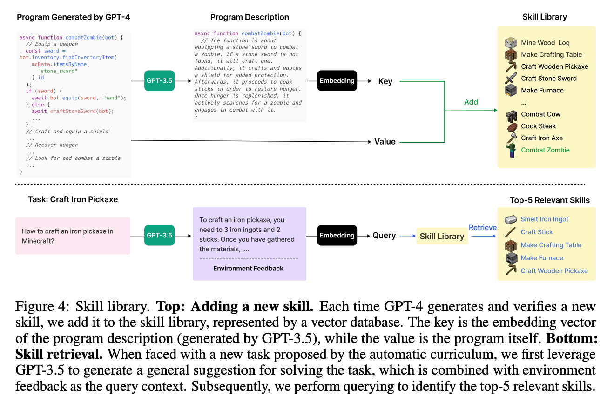
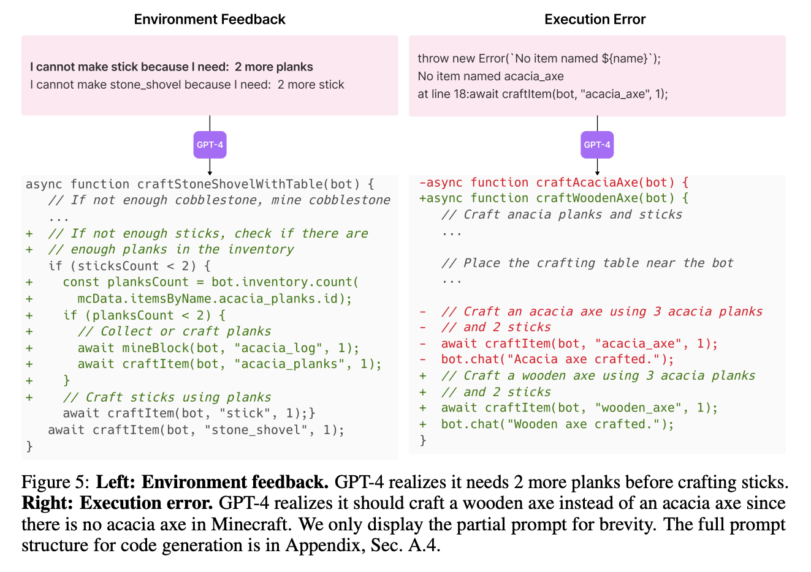
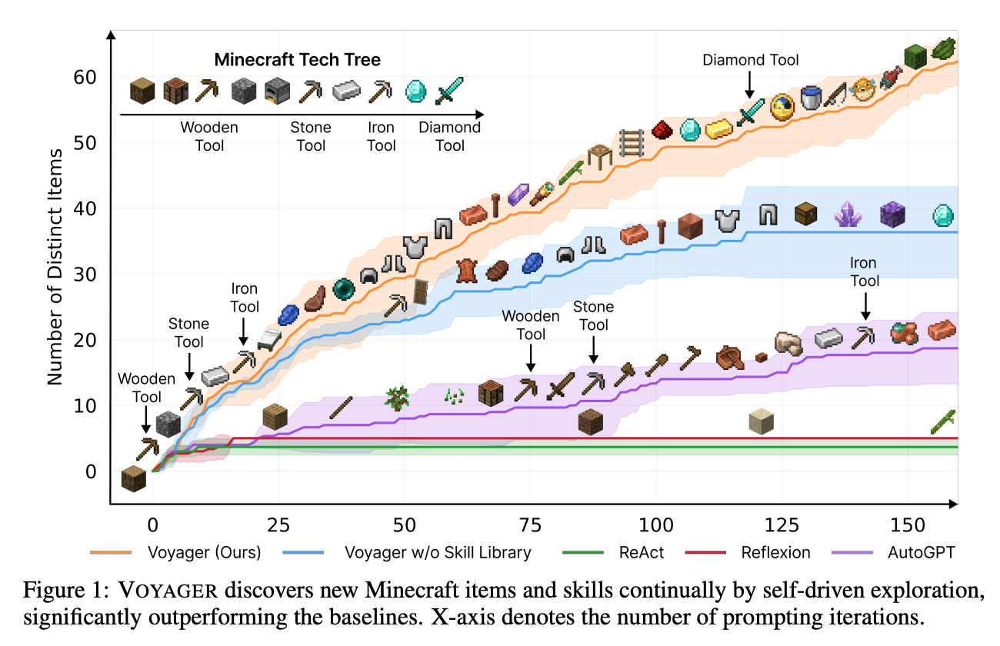
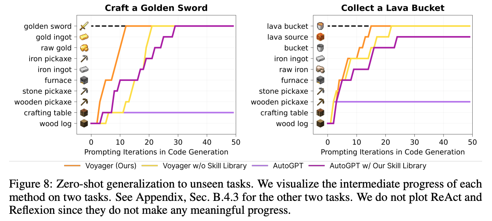

# Voyager: An Open-Ended Embodied Agent with Large Language Models

**Link**: [Paper](http://arxiv.org/pdf/2305.16291v1)

**Authors**: Guanzhi Wang[^1][^2], Yuqi Xie[^3], Yunfan Jiang[^4], Ajay Mandlekar[^1], Chaowei Xiao[^1][^5], Yuke Zhu[^1][^3], Linxi Fan[^1], Anima Anandkumar[^1][^2]

[^1]: NVIDIA
[^2]: Caltech
[^3]: UT Austin
[^4]: Stanford
[^5]: ASU

## Summary

**TL;DR: VOYAGER, the first Large Language Model powered lifelong learning agent in Minecraft, demonstrates superior performance in exploration, skill acquisition, and task completion, outperforming prior state-of-the-art by leveraging an automatic curriculum, a skill library, and a self-verification module, setting a new benchmark for AI performance in open-ended worlds.**

This paper introduces VOYAGER, the first Large Language Model (LLM)-based embodied lifelong learning agent in Minecraft, an open-ended game with infinite possibilities. The agent is designed to have capabilities similar to human players, such as working on appropriate tasks based on current skill level and world state, acquiring, remembering, and refining skills, and continually exploring the work and seeking out new tasks in a self-driven manner. The challenge is to enable the agent to explore, plan, and develop new skills in such open-ended worlds, a task that has been a major challenge for the AI community.

### Approach

VOYAGER is composed of three key components: an **automatic curriculum** that maximizes exploration, a **skill library** for storing and retrieving complex behaviors, and a new **iterative prompting mechanism** that generates executable code for embodied control.

The **automatic curriculum** leverages the internet-scale knowledge contained within GPT-4, providing a steady stream of new tasks or challenges in a bottom-up fashion, fostering curiosity-driven intrinsic motivation for the agent to learn and explore. The agent interacts with GPT-4 and queries for next tasks based on the current game state, and previously completed/failed tasks.

The agent incrementally builds a **skill library** by storing the action programs that help solve a task successfully. This allows the agent to progressively acquire, update, accumulate, and transfer knowledge over extended time spans, similar to how a human player would adapt to different situations in the game. Each program is indexed by the embedding of its description, which can be retrieved in similar situations in the future. Complex skills can be synthesized by composing simpler programs, which compounds VOYAGER’s capabilities rapidly over time and alleviates catastrophic forgetting in other continual learning methods. The programs are generated using an iterative prompting mechanism.

The **iterative prompting mechanism** generates and executes the program, incorporates feedback into GPT-4’s prompt for code refinement, and repeats the process until a self-verification module confirms the task completion. There are 3 types of feedback used in each iteration: environmental feedback, execution errors, and criticism form the self-verification module. This self-verification module, another instance of GPT-4, acts as a critic, verifying task success, reflecting on errors, and suggesting improvements.

### Results

VOYAGER demonstrates strong in-context lifelong learning capability and exceptional proficiency in playing Minecraft. It obtains 3.3× more unique items, travels 2.3× longer distances, and unlocks key tech tree milestones up to 15.3× faster than prior state-of-the-art. Additionally, VOYAGER can utilize the learned skill library in a new Minecraft world to solve novel tasks from scratch, outperforming other techniques in generalization. In comparison to other representative algorithms such as ReAct, Reflexion, and AutoGPT, which were adapted for the Minecraft environment, VOYAGER outperforms them in terms of efficiency and mastery of the tech tree. Furthermore, VOYAGER is the only agent to unlock the diamond level of the tech tree, underscoring the effectiveness of the automatic curriculum. It also outperforms in navigating a variety of terrains, including 'plains', 'dripstone_caves', 'savanna', 'meadow', 'snowy_taiga', 'stony_shore', 'forest', 'ocean', while baseline agents often find themselves confined to local areas. In zero-shot generalization tests, VOYAGER consistently solved all tasks, while baselines could not solve any task within 50 prompting iterations.

The skill library constructed from lifelong learning not only enhanced VOYAGER’s performance but also boosted AutoGPT, demonstrating its versatility and potential as a plug-and-play asset to enhance performance. Ablation studies showed that without the skill library, VOYAGER tends to plateau in later stages, highlighting the importance of the skill library in creating complex actions and pushing the agent's boundaries. The self-verification module was found to be critical, with a 73% drop in item discovery when it was removed. GPT-4 significantly outperformed GPT-3.5 in code generation, obtaining 5.7x more unique items.

## Conclusion

In conclusion, VOYAGER demonstrates the potential of Large Language Models in creating embodied lifelong learning agents. It effectively mimics human players' capabilities, proposing suitable tasks based on its current skill level and world state, refining skills based on environmental feedback, and continually exploring the world in a self-driven manner. Compared to other methods, VOYAGER's unique combination of an automatic curriculum, skill library, and self-verification module gives it a distinct advantage in terms of efficiency and adaptability.
